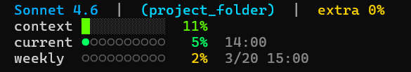

# Claude Code statusline for Windows + PowerShell

Windows の Git Bash 環境で動作する Claude Code 用カスタム statusline です。
コンテキストウィンドウの使用率と API 利用状況をリアルタイムで確認できます。

> **Note:** statusline は Claude Code CLI 専用の機能です。VSCode 拡張機能のチャットパネルには表示されません。VSCode 内で使う場合は統合ターミナル (`Ctrl+``) から `claude` コマンドで CLI を起動してください。

## 表示内容



| 行 | 内容 |
|---|---|
| 1行目 | モデル名、リポジトリ名、ブランチ (未コミット変更は `*`)、Extra Usage |
| context | コンテキストウィンドウ使用率 (`█░` ブロックメーター) |
| current | 5時間枠の API 使用率 (`●○` ドットメーター) + リセット時刻 |
| weekly | 7日枠の API 使用率 (`●○` ドットメーター) + リセット時刻 |

### context の色分け

コンテキスト使用率に応じてメーターとパーセント表示の色が変わります。
compact エラーを防ぐため、早めの `/compact` 実行や新規セッション開始の判断に使えます。

| 使用率 | 色 | 意味 |
|---|---|---|
| 0-59% | 緑 | 余裕あり |
| 60-79% | 黄色 | そろそろ `/compact` を検討 |
| 80-89% | オレンジ | `/compact` 推奨 |
| 90%+ | 赤 | 自動 compact が迫っている。すぐ対処 |

## 前提条件

- Windows 10/11
- Git Bash (Git for Windows に同梱)
- PowerShell (`pwsh` 推奨、Windows PowerShell 5.1 でも動作)
- Claude Code CLI がインストール済みで OAuth ログイン済み

## インストール

1. このリポジトリを任意の場所にクローンします。

   ```bash
   git clone https://github.com/matsuikentaro1/claude-statusline_windows.git
   ```

2. Claude Code に statusline を設定します。Claude Code のセッション内で以下のように依頼してください。

   ```
   claude-statusline_windows リポジトリの statusline.sh を
   グローバル設定 (~/.claude/settings.json) の statusLine に登録してください。
   パスは私の環境に合わせて絶対パスで設定してください。
   ```

   手動で設定する場合は `~/.claude/settings.json` に以下を追加します。
   パスは自分の環境に合わせて書き換えてください。

   ```json
   {
     "statusLine": {
       "type": "command",
       "command": "\"/path/to/claude-statusline_windows/statusline.sh\""
     }
   }
   ```

   参考: `settings.user.snippet.json` にサンプルがあります。

3. Claude Code を再起動するか、新しいセッションを開始します。

## ファイル構成

| ファイル | 説明 |
|---|---|
| `statusline.ps1` | statusline 本体。コンテキスト・Git 情報・usage API 取得・キャッシュを処理 |
| `statusline.sh` | Git Bash ラッパー。`pwsh` → `powershell.exe` の順にフォールバック |
| `settings.user.snippet.json` | settings.json に追加する設定のサンプル |

## 仕組み

1. Claude Code が `statusline.sh` を Git Bash 経由で実行
2. `statusline.sh` が PowerShell (`pwsh` or `powershell.exe`) を起動
3. `statusline.ps1` が stdin から Claude Code の JSON データ (モデル情報・コンテキスト使用率など) を受け取る
4. Anthropic OAuth usage API (`https://api.anthropic.com/api/oauth/usage`) から 5時間/7日枠の利用状況を取得 (1分間キャッシュ)
5. 整形して stdout に出力 → Claude Code がターミナル下部に表示

## 環境変数

| 変数 | 説明 | 既定値 |
|---|---|---|
| `CC_STATUSLINE_CACHE_TTL_SECONDS` | usage API のキャッシュ秒数 | `60` |
| `CC_STATUSLINE_NO_COLOR=1` | ANSI カラーを無効化 | off |
| `CC_STATUSLINE_ASCII=1` | メーターを `#` `.` の ASCII 文字に切り替え | off |
| `CC_STATUSLINE_SINGLE_LINE=1` | 全情報を 1 行にまとめて表示 | off |
| `CC_STATUSLINE_DEBUG=1` | エラー発生時にスタックトレースを表示 | off |

## 補足

- 日本語 Windows を考慮し、PowerShell 側の stdin/stdout を UTF-8 に固定しています。
- 資格情報は `%USERPROFILE%\.claude\.credentials.json` から読み取ります。
- API 取得に失敗した場合、最後に成功したキャッシュがあればそれを使います。
